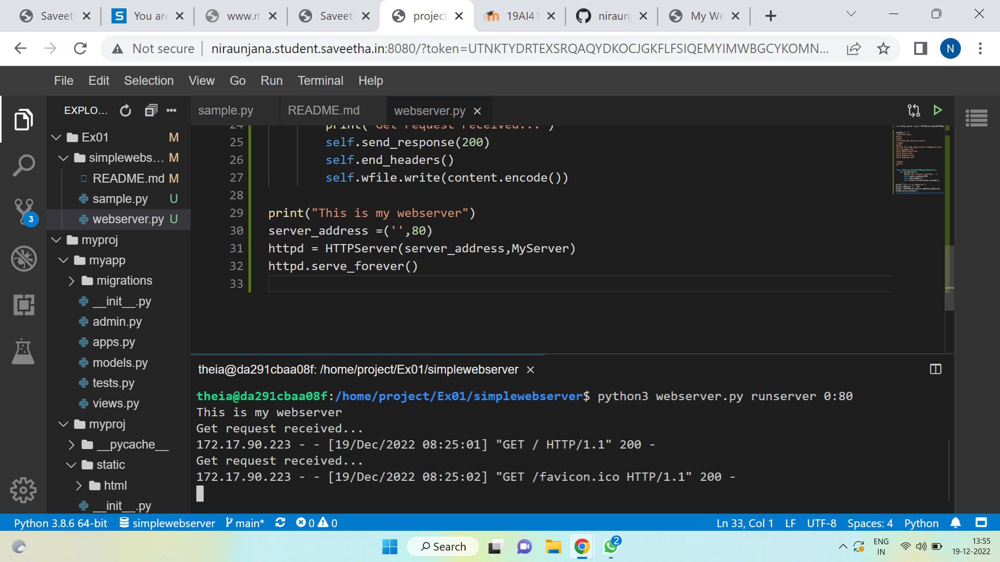
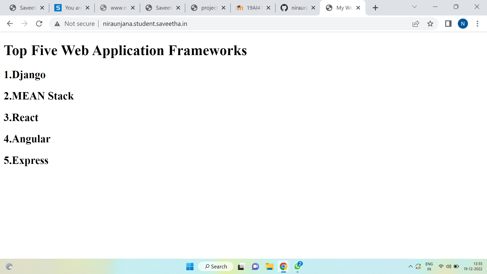

# Developing a Simple Webserver
## AIM:
To develop a simple webserver to display top five programming languages.

## DESIGN STEPS:
### Step 1: 
HTML content creation
### Step 2:
Design of webserver workflow
### Step 3:
Implementation using Python code
### Step 4:
Serving the HTML pages.
### Step 5:
Testing the webserver

## PROGRAM:
```
content = """
<!DOCTYPE html>
<html>
<head>
<title>My Web Server</title>
</head>
<body>
<h1>Top Five Web Application Frameworks</h1>
<h2>1.Django</h2> 
<h2>2.MEAN Stack</h2>
<h2>3.React</h2>
<h2>4.Angular</h2>
<h2>5.Express</h2>

</body>
</html>
"""

class MyServer(BaseHTTPRequestHandler):
    def do_GET(self):
        print('Get request received...')
        self.send_response(200)
        self.end_headers()
        self.wfile.write(content.encode()) 

print("This is my webserver")
server_address =('',80)
httpd = HTTPServer(server_address,MyServer)
httpd.serve_forever()
```
## OUTPUT:

### Server Side Output




### Client Side Output





## RESULT:

Thus the webserver is developed to display about top five programming languages.

